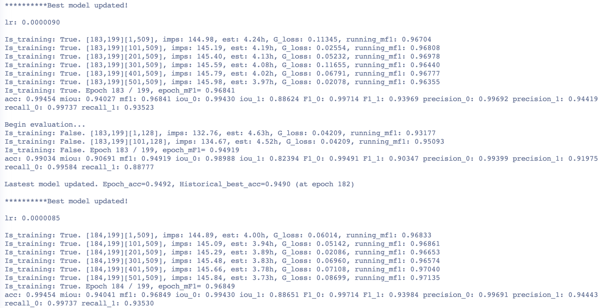
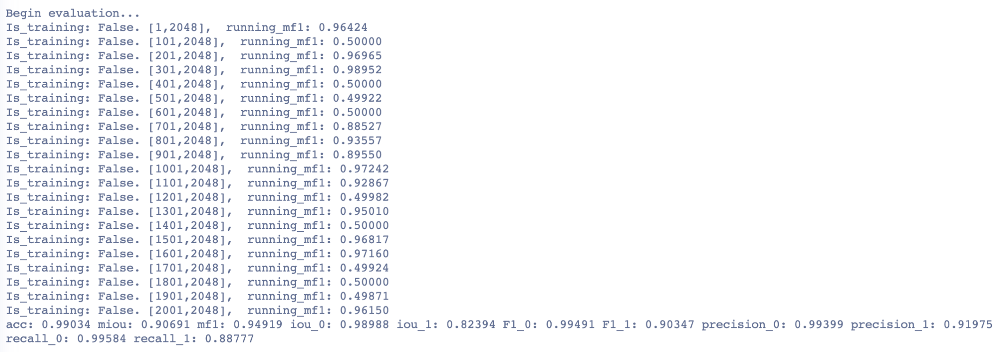
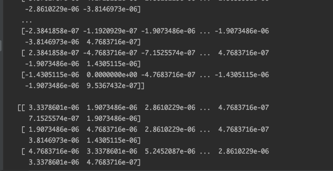
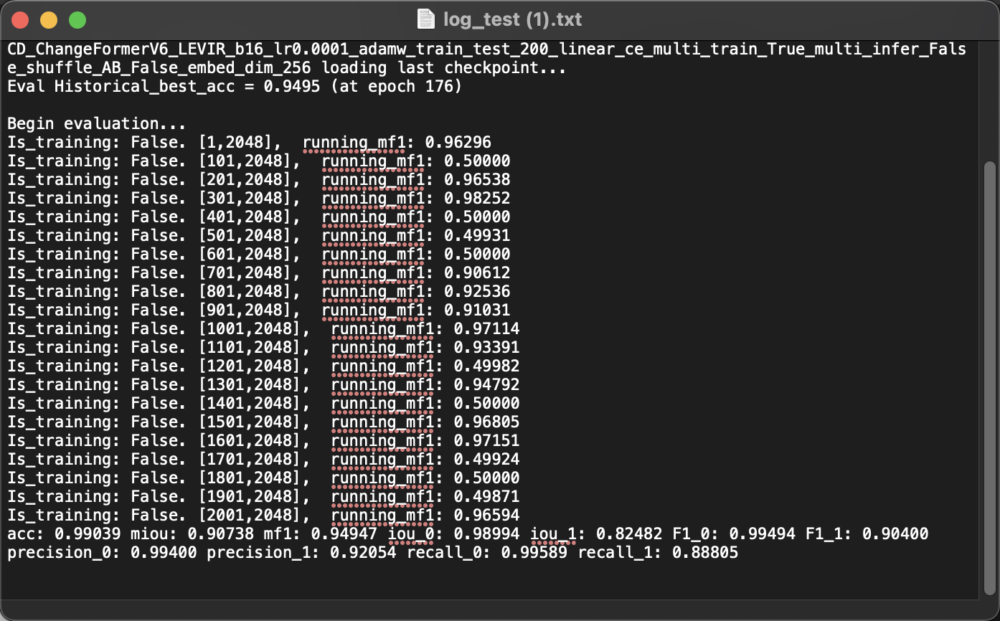
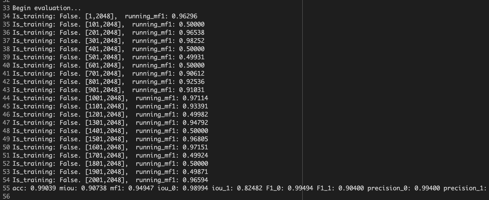

# A TRANSFORMER-BASED SIAMESE NETWORK FOR CHANGE DETECTION

## 目录

- [1. 简介]()
- [2. 数据集和复现精度]()
- [3. 准备数据与环境]()
    - [3.1 准备环境]()
    - [3.2 准备数据]()
    - [3.3 准备模型]()
- [4. 开始使用]()
    - [4.1 模型训练]()
    - [4.2 模型评估]()
    - [4.3 模型预测]()
- [5. LICENSE]()
- [6. 参考链接与文献]()
- [7. 对齐]()


## 1. 简介

ChangeFormer不同于以往的基于CNN的变化监测框架，使用Transformer模块替代CNN的Conv模块达到抽取特征的目的，同时，使用双流架构从前后时相的影像里抽取多尺度的可识别地域变化的特征，在网络最后使用MLP层进行解码获取影像所示区域的变化像素，并以二值图的形式显示。


（效果图来自原文）

**论文:** [A TRANSFORMER-BASED SIAMESE NETWORK FOR CHANGE DETECTION](https://arxiv.org/pdf/2201.01293.pdf)

**参考repo:** [ChangeFormer](https://github.com/wgcban/ChangeFormer)

在此非常感谢`$wgcban$`等人贡献的[ChangeFormer](https://github.com/wgcban/ChangeFormer)，提高了本repo复现论文的效率。

**aistudio体验教程:** [地址](url)若验收成功再提供。


## 2. 数据集和复现精度

repo用到的数据集是LEVIR数据集的采样，具体构建参见[ChangeFormer](https://github.com/wgcban/ChangeFormer)。本repo直接使用其提供的处理后数据集[`LEVIR-CD-256`](https://www.dropbox.com/sh/lnjxpflvgjijwoj/AAAgWr3xgOjqtTWPVpbLVcfNa?dl=0)。

数据集简介：

- 数据集大小：数据集总共有10192张256x256的图像，训练集：7120，验证集：1024，测试集：2048。

- 数据集下载链接：https://www.dropbox.com/sh/lnjxpflvgjijwoj/AAAgWr3xgOjqtTWPVpbLVcfNa?dl=0

- 数据格式：

  > """
  >
  > Change detection data set with pixel-level binary labels；
  >
  > ├─A
  >
  > ├─B
  >
  > ├─label
  >
  > └─list
  >
  > """

  `A`: t1时相图像;

  `B`: t2时相图像;

  `label`: 真实标签;

  `list`: 包含 `train.txt, val.txt and test.txt`, 文件存储了训练集、验证集和测试集的图像名。（注：在实际训练里，使用训练集+验证集进行训练，这也是根据[ChangeFormer](https://github.com/wgcban/ChangeFormer)放出的log确定的。）


复现情况（LEVIR数据集）：

| 论文精度（F1） | 复现精度（F1） | 下载链接                                                     |
| -------------- | -------------- | ------------------------------------------------------------ |
| 90.40          | 90.347         | 链接: https://pan.baidu.com/s/156DgD9bXHBL2gWmbZtIEQQ 提取码: qj21 |


## 3. 准备数据与环境

### 3.1 准备环境

repo使用硬件和框架版本等环境的要求如下：

- 硬件：Nvidia Tesla v100  x1 
- 框架：
  - PaddlePaddle >= 2.3.1


库安装：

- PaddlePaddle：

```shell
python -m pip install paddlepaddle-gpu==2.3.1 -i https://mirror.baidu.com/pypi/simple
```

- 其余库：

AI-Studio都有安装，可直接使用。若自行配环境也可根据缺失库安装，三方库不多，安装很方便。

### 3.2 准备数据

可参见2中数据格式，将自定义数据集按照该格式整理即可使用。


### 3.3 准备模型

- 预训练模型：

  ChangeFormer模型的训练使用了ADE 160k进行预训练，并基于这一预训练权重进行在LEVIR数据集上的训练。

  - 这里提供原始pytorch权重下载地址：https://www.dropbox.com/s/undtrlxiz7bkag5/pretrained_changeformer.pt?dl=0。
  - paddle格式权重下载地址：链接: https://pan.baidu.com/s/1AK_mO6Pkha83g2lm6z2WDg 提取码: 1mqc
  
- 使用：

  - 将其paddle权重下载后解压至项目根目录下。


## 4. 开始使用

### 4.1 模型训练

下载前文提供的数据后，将其解压到项目根目录下的CDData路径下。

在`scripts`路径下：

```shell
cd scripts
# 使用以下命令：
sh run_ChangeFormer_LEVIR.sh
```

`run_ChangeFormer_LEVIR.sh`文件内容如下：

```shell
#!/usr/bin/env bash

#GPUs
gpus=0

#Set paths
checkpoint_root=./checkpoints
vis_root=./vis
data_name=LEVIR

# hyper params.
img_size=256    
batch_size=16   
lr=0.0001         
max_epochs=200
embed_dim=256

net_G=ChangeFormerV6        #ChangeFormerV6 is the finalized verion

lr_policy=linear
optimizer=adamw                 #Choices: sgd (set lr to 0.01), adam, adamw
loss=ce                         #Choices: ce, fl (Focal Loss), miou
multi_scale_train=True
multi_scale_infer=False
shuffle_AB=False

#Initializing from pretrained weights
pretrain=../../data/data161387/pretrained_changeformer.pdparam # your path to pretrain model.

#Train and Validation splits
split=trainval         #trainval
split_val=test      #test
project_name=CD_${net_G}_${data_name}_b${batch_size}_lr${lr}_${optimizer}_${split}_${split_val}_${max_epochs}_${lr_policy}_${loss}_multi_train_${multi_scale_train}_multi_infer_${multi_scale_infer}_shuffle_AB_${shuffle_AB}_embed_dim_${embed_dim}

# CUDA_VISIBLE_DEVICES=0
cd ..
CUDA_VISIBLE_DEVICES=0 python main_cd.py --img_size ${img_size} --loss ${loss} --checkpoint_root ${checkpoint_root} --vis_root ${vis_root} --lr_policy ${lr_policy} --optimizer ${optimizer} --pretrain ${pretrain} --split ${split} --split_val ${split_val} --net_G ${net_G} --multi_scale_train ${multi_scale_train} --multi_scale_infer ${multi_scale_infer} --gpu_ids ${gpus} --max_epochs ${max_epochs} --project_name ${project_name} --batch_size ${batch_size} --shuffle_AB ${shuffle_AB} --data_name ${data_name}  --lr ${lr} --embed_dim ${embed_dim}

```

训练日志如下：



全部日志在`checkpoints`路径下（需下载解压训练权重文件）。

注意⚠️：

==这里使用的trainval数据集进行训练，在数据集的list路径下将train.txt和val.txt的内容拼接成trainval.txt即可。==

### 4.2 模型评估

在`scripts`路径下：

```shell
cd scripts
# 使用以下命令：
sh eval_ChangeFormer_LEVIR.sh
```

`eval_ChangeFormer_LEVIR.sh`文件内容如下：

```shell
#!/usr/bin/env bash

# gpus=0
gpus=0

data_name=LEVIR
net_G=ChangeFormerV6 #This is the best version
split=test
vis_root=./vis
project_name=CD_ChangeFormerV6_LEVIR_b16_lr0.0001_adamw_trainval_test_200_linear_ce_multi_train_True_multi_infer_False_shuffle_AB_False_embed_dim_256_v0
checkpoints_root=./checkpoints
checkpoint_name=best_ckpt.pdparam
img_size=256
embed_dim=256 #Make sure to change the embedding dim (best and default = 256)

cd ..
CUDA_VISIBLE_DEVICES=0 python eval_cd.py --split ${split} --net_G ${net_G} --embed_dim ${embed_dim} --img_size ${img_size} --vis_root ${vis_root} --checkpoints_root ${checkpoints_root} --checkpoint_name ${checkpoint_name} --gpu_ids ${gpus} --project_name ${project_name} --data_name ${data_name}
```

训练日志如下：



全部日志在`checkpoints`路径下（需下载解压训练权重文件）。

### 4.3 模型预测

- demo

```shell
python demo_LEVIR.py
```


(测试结果其一)

## 5. LICENSE

本项目的发布受[Apache 2.0 license](./LICENSE)许可认证。

## 6. 参考链接与文献

- **论文:** [A TRANSFORMER-BASED SIAMESE NETWORK FOR CHANGE DETECTION](https://arxiv.org/pdf/2201.01293.pdf)

- **参考repo:** [ChangeFormer](https://github.com/wgcban/ChangeFormer)

## 7. 对齐

- 前向：



同一fake—data，torch和paddle模型输出差值，可认为0.

- 推理：

加载同一模型权重（pytroch提供的预训练权重）：



（paddle）



（pytorch）

测试集测试F1和loss均一致，可知模型组网和实现均已对应。

- 组网：
  - 组网过程均按照pytorch实现一一对应。
